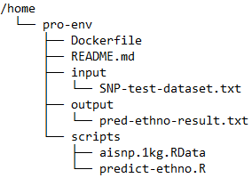

# R scripts for ethnicity and age prediction

Purpose of this example code is to illustrate how ethnicity can be predicted based genotype data (R script: "**predict-ethno.R**"), specifically on ancestry informative single nucleotide positions (AISNPs) identified by Kidd and Seldin (see Pakstis *et al* 2019: <https://www.nature.com/articles/s41598-019-55175-x>) as well as using ethnicity-specific allel frequencies derived from the 1000 genome project (see: <https://www.internationalgenome.org/>). Further, script code (R script: "**predict-age.R**") is provided as an example on how to infer biological and phenological age (interpreted as lifespan) using algorithms developed by Horvath and colleagues (see Levine *et al* 2018: <https://www.ncbi.nlm.nih.gov/pmc/articles/PMC5940111/>) from DNA methylation data generated by Illumina's EPIC array assays.

<br>

### Installation procedure
If you have git (see: <https://github.com/git-guides/install-git>)and docker installed on your local machine (see: <https://docs.docker.com/get-docker/>) you can perform the following steps:

1. Copy all files from git repo to your local machine
```
sudo git pull https://github.com/roland-zauner/predict-age-ethno
```
2. Build docker image containing R and respective libraries defined in the Dockerfile 
```
sudo docker build -t predict:latest .
```

<br>

### How to perform ethnicity prediction (Kidd and Seldin AISNP panel)

The following folder structure is assumed:
<br>

1. Provide genotype/SNP data in folder "input", an anonymized, randomized example file is provided  

2. Run R script **predict-ethno.R** in docker container with arguments "path to SNP data (.txt) and 1000 genome allele frequency data file (aisnp.1kg.RData)"
```
sudo docker run --rm -v /home/pro-env/input:/home/input -v /home/pro-env/output:/home/output pred-ethno:latest Rscript /home/scripts/predict-ethno.R /home/input/SNP-test-dataset.txt /home/scripts/aisnp.1kg.RData
```
3. Inspect prediction result in folder "output" (plain txt file)

<br>

### How to perform DNAm age prediction (Horvath SkinBlood and Horvath/Levine PhenoAge clocks)

1. Provide Illumina EPIC array raw data files (end with _Red.idat and _Grn.idat) in folder "input" 

2. Run R script **predict-age.R** in docker container with argument "path to input folder"
```
sudo docker run --rm -v /home/pro-env/input:/home/input -v /home/pro-env/output:/home/output predict:latest Rscript /home/scripts/predict-age.R /home/input/
```
3. Inspect prediction result in folder "output" (plain txt file)


<br>

### Disclaimer
Software refers to the here (github/roland-zauner/predict-age-ethno) provided R scripts including any underlying software packages such as R, docker, R packages and algorithms (in specific from Horvath & collegues or respective package authors) provided in R packages as well as data derived from resources such as the 1000 genome project.
<br>Provider refers to the owner of this github account (github/roland-zauner/predict-age-ethno).
<br>User refers to anyone using software provided on this github account.

<p> The software is provided 'as is,' without warranty of any kind. In no event shall the provider (github account roland-zauner) be liable for any damages whatsoever, including but not limited to, direct, indirect, special, incidental or consequential damages, loss of business profits or special damages, even if the provider has been advised of the possibility of such damages. The manufacturer shall have no liability for any claims, damages or fees arising from the use of the software in a manner that violates any intellectual property rights or any applicable licenses. The entire risk as to the results and performance of the software is assumed by the user. Without limiting the foregoing, the provider shall have no liability for any damage or injury to person or property arising out of the use or inability to use the software, or any unauthorized access to or alteration of your transmissions or data.

<p>This is free software, and you are welcome to redistribute it
under conditions of the GNU GENERAL PUBLIC LICENSE (see <https://www.gnu.org/licenses/>) 
which also applies for underlying software packages used by this script, eg statistical software R.
The GNU General Public License does not permit incorporating your program
into proprietary programs.
